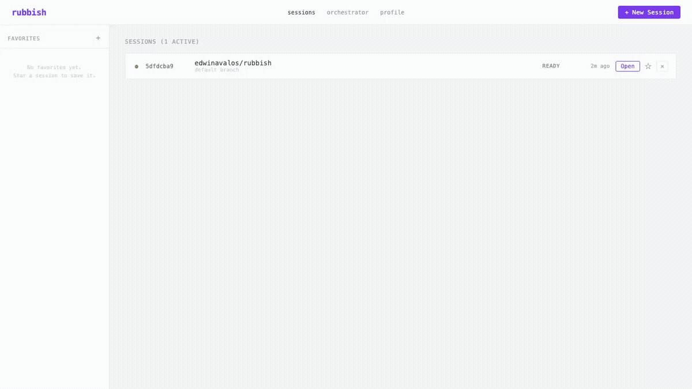
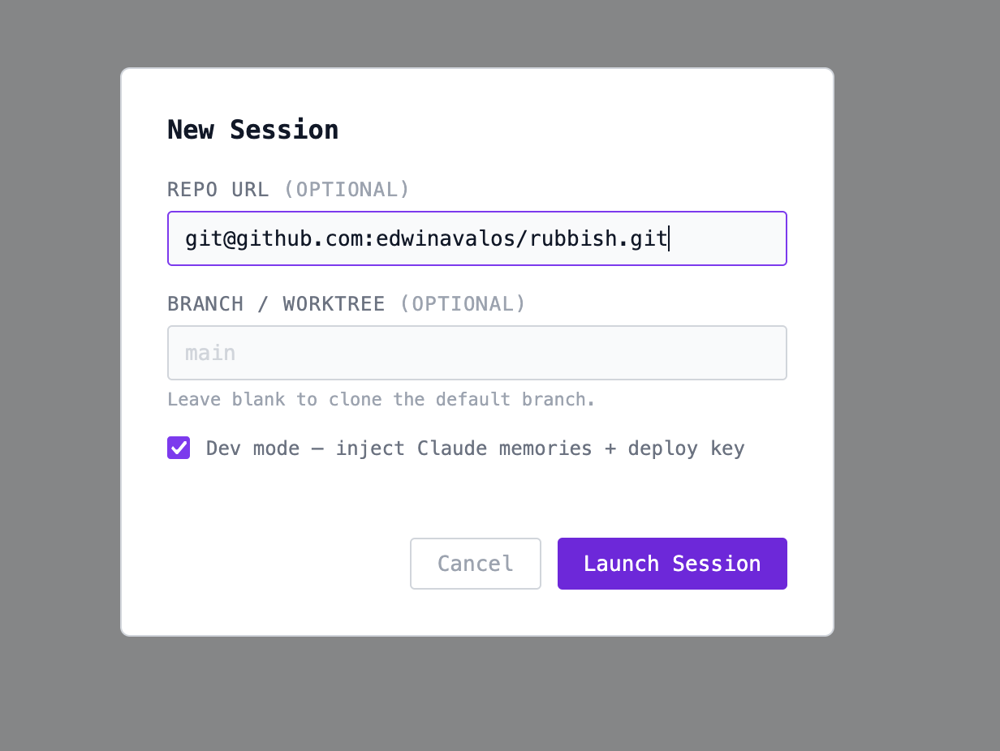
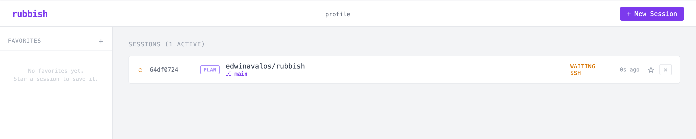
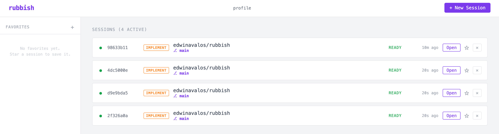
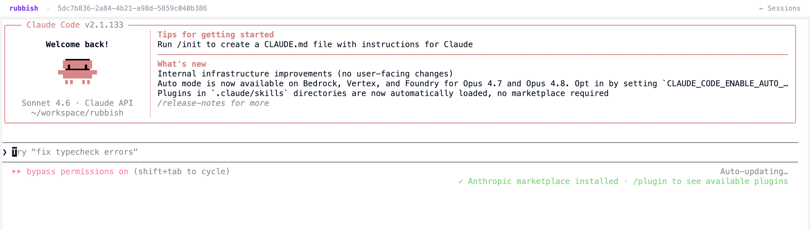
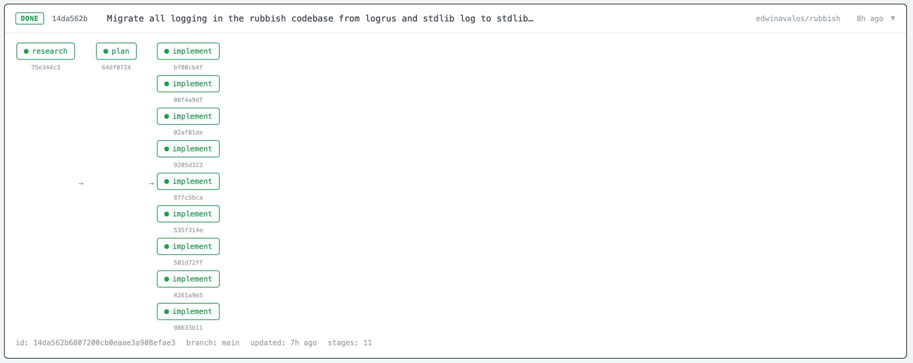

# Screenshots

A visual tour of the rubbish UI in the browser.

---

## New Session — Launch Flow (animated)

Click **+ New Session**, fill in a repo, and hit **Launch Session**. The VM boots, progresses through provisioning → configuring → ready, and the browser navigates directly to a live Claude Code terminal — all in under 5 seconds.

---

## New Session Modal

The **New Session** dialog. Repo URL is pre-filled from the last used value; branch is optional; **Dev mode** injects Claude memories and the deploy key into the VM at boot.

---

## Sessions — Waiting for SSH

A newly created session in the **PLAN** stage, waiting for the VM to come up and accept an SSH connection.

---

## Sessions — Multiple Implement Workers Ready

Four parallel **IMPLEMENT** sessions all in the **READY** state. Each session is an isolated VM running a fan-out worker from the same workflow.

---

## Interactive Terminal — Claude Running

A live Claude Code session inside a Firecracker microVM. The terminal proxies WebSocket → SSH into the VM; Claude starts automatically with `--dangerously-skip-permissions`.

---

## Workflow Detail — Completed Fan-out

A completed workflow showing the full execution graph: a single **research** stage, a single **plan** stage, and eight parallel **implement** workers that ran concurrently. Status is **DONE**.

